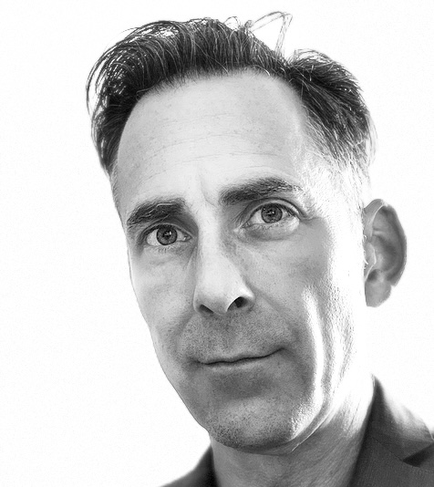

# Mikael Jagelid

Curriculum Vitae

`email`    [mikael.jagelid@gmail.com](mailto:mikael.jagelid@gmail.com) |
`linkedin` [mikaeljagelid](https://www.linkedin.com/in/your-linkedin-url/) |
`phone` [+46 768 514 683] |

Mikael is a dynamic management consultant with expertise in strategy, innovation, business development, and digital transformation. His background blends a deep understanding of technology from his engineering roots, hands-on experience as an entrepreneur creating and building companies, and an unwavering commitment to sustainability and innovation.

This combination has solidified Mikael as a trusted authority in advising management, boards, and investors. Beyond his consulting prowess, Mikael is a captivating speaker who relishes sharing his insights on ongoing trends.

## Work Experience - Summary

### *Oct 2018 --* HiQ Göteborg AB
Senior Business Development Consultant

### *2018* Madrik AB
Business Developer, acting CFO, 

### *2017 -- 2018* European Commission Executive Agency for SMEs (part-time)
Business Innovation Coach

### *2015 -- 2018* Miveo Car-sharing Technologies AB
Business Development/Chairman of the Board/Partner

### *2013 --* Blasieholmen Investment Group (part time)
IPO Process Advisor

### *2010 -- 2019* Cleantech Inn Sweden AB
Business Advisor and Partner

### *2008-2010* Solberg AB
Senior Communications and Investor Relations Consultant

### *2001 -- 2008* Morphic Technologies AB
Company building, Business development and investor relations

### *2000-2001* Ambient Society AB
Project Manager and Partner

### *1997 - 2000* SKF Nova AB
Technical and Business Development

## Education

*1991 - 1997* MSc Electronics -- Chalmers University of Technology
Master Thesis: "Analysis, Design and Simulation of Active Magnetic Thrust Bearings"

*May 2023* "Certifiering i styrelsearbete" -- Västsvenska Handelskammaren 
---
## Skills

*IT* MS Office, Keynote, Google Apps, Slack, Miro, Hubspot, Coda, GitHub, Adobe InDesign, macOS, Visio, and more.

*Languages* Swedish (native), English (fluent)

## Honours and Awards
*2016* Frost \& Sullivan Growth Excellence Leadership Award -- issued by Frost \& Sullivan
*1997* SKF Innovation Award "High Speed Grinding Spindle with Oscillating Active Magnetic Thrust Bearings"-- SKF Group 

## Industry Experience

*Manufacturing* Mikael embarked on his career in the manufacturing sector and stayed there for his first decade. During this time, he focused on digitalization and connectivity within production machinery and processes.

*Finance* Mikael has played an active role in the finance sector, initially as an investor relations manager and investor relations consultant. Later, he extended his expertise to support startups and scaleups in funding and IPO processes. Additionally, he contributed to new business development within the car leasing industry.

*Energy* The renewable energy sector has been a consistent part of Mikael's journey, taking on various roles. These ranged from condition monitoring in wind turbines to funding large wind farms and driving innovation within wave power, solar energy, and biogas. More recently, he has been involved in energy service development processes for utilities.

*Sustainability* Pioneering in the fuel cell industry ignited Mikael's interest in cleantech and sustainability. He later had the opportunity to work with sustainablity reporting and communication, and then to identify, assess, and support promising cleantech startups.

*Mobility* Mikael has experience in developing, launching, and operating car-sharing services. Concurrently, he explored and tested combinations of mobility services for car manufacturers and leasing companies.

*Automotive* He has been involved in strategies related to the ongoing transformations characterizing the automotive industry today, including electrification, sharing, connectivity, and autonomous driving solutions.

*Commerce* Mikael has been actively engaged in transformation projects within the retail industry, with a specific focus on identifying and mapping value creation processes.

---
## Appendix - Detailed Work Experience 
### *Since Oct 2018* HiQ Göteborg AB -- Senior Business Development Consultant
Currently holding a combined position as strategy and business development consultant, interim key account manager for Volvo Group and business developer for the HiQ Göteborg organisation.

Mikael supports the sales organisation in pre-sales, customer pre-studies and market research. Since September 2023 Mikael is also acting key account manager for the Volvo Group accounts, responsible for sales planning, forecasting and budgeting.

With a company in transformation since a PE buyout three years ago, Mikael has assisted the HiQ management teams in strategy and business development. 

Mikael has also been given a role to drive the thought leadership of the organisation, providing trend insights, running think tanks and giving inspirational talks. 

In his assignments, Mikael has joined multifunctional teams where he has been responsible for everything relating to the customers business, like  exploring or developing business models, market research and compliance with long term goals and strategies. Working closely with service designers, Mikael has seamlessly integrated service design principles into business and strategy challenges, offering clients holistic strategies that enhance both growth and the customer experience.

### Selected examples of assignments
Lynk \& Co: Development of new service offers, financial models and processes.

Volvofinans Bank: Development of long term strategies and new offers for the car leasing market.

Essity: Pre-study and due-diligence

Global industrial client (confidential): Due-diligence and process development for major digitalisation initiative.

Bubbleroom: "as-is" and "to-be" scenarios for replacing ERP and e-commerce platform.

Other clients include Göteborg Energi, Bokusgruppen, Volvo Construction Equipment, Batteryloop, Yamaha Motors, LEGO, SKF, Västtrafik among others.

### *May -- Oct 2018* Madrik AB -- Business Developer, acting CFO, 
Mikael was hired by the holding company Madrik AB to develop a growth-oriented business case for the Madrik portfolio company GreenStar Marine AB, offering electric propulsion for the recreational boating industry.

### *2017 -- 2018 (part-time)* European Commission Executive Agency for SMEs -- Business Innovation Coach
Contracted as coach in the Horizon 2020 program for SME’s in the areas of electric vehicle components, charging solutions for electric vehicles, and solar energy (Spain). As an integral part of the Horizon 2020 program, European SMEs benefiting from certain grant funding where offered business coaching to help their business scale up and grow. The selected coaches supported the SME's in developing strategy and organisation, identifying market segments and improving the ability to attract further funding.
---
### *July 2015 -- May 2018* Miveo Car-sharing Technologies AB -- Business Development/Chairman of the Board/Partner
Mikael became partner through a combined management buy-in/buy-out of the car sharing division in telematics pioneer Pilotfish AB in 2015. Mikael supported clients like car manufacturers, global leasing companies and car sharing operators to design, launch and grow mobility service operations in Europe and North America. The results from his team was recognized with the Frost \& Sullivan Growth Excellence Award in 2016.
Working in a small management team in business development, sales, marketing and strategies for emerging business models related to mobility in urban environments. Mikael was also responsible for communications and investor relations, representing and presenting the company at conferences and for investors.

As part of the business development process, Mikael performed tracking and continuous analysis of global market trends, venture capital, startups, mergers \& acquisitions, new technologies, policies, etc, related to mobility and mobility-as-a-service.

Mikael had a key role in the merger between Miveo and Move About AS in 2017.

### *2013 -- (part time)* Blasieholmen Investment Group -- IPO Process Advisor
Mikael has been contracted by Blasieholmen Investment Group as advisor in several IPO processes for high-risk, technology driven ventures entering the Nasdaq First North Stock Exchange. The assignments included early stage due-diligence, risk- and strategy assessments and refinement of the business cases. Mikael’s specialty is to make a technically strong case a compelling, convincing and exciting investment case.

### *2010 -- 2019* Cleantech Inn Sweden AB -- Business Advisor
Cleantech Inn Sweden was a networking platform for entrepreneurs and industry actors, providing support to generate profitable growth through solving global sustainability challenges. Initially funded by Vinnova, Tillväxtverket and others, Mikael together with a partner acquired the operations and brand in 2016. In 2019 the entire operations and brand was acquired by RISE.

Mikael evaluated more than 100 Swedish cleantech startups for entering the Cleantech Inn cluster, assessing the applicant’s business, market and technology risks, assessment of sustainability and the positive impact on the environment from the solutions provided by the applicants. 

Mikael generated progress and growth for cluster members through business development, coaching and advising, while working close to owners, boards and management teams.

Supporting large industries seeking solutions for sustainability challenges, Mikael created, sold and executed matchmaking processes and technology scouting. Clients included Alfa Laval, Tetra Pak, Siemens and E.On.

Mikael was selected by Zennström Philanthropies to advise in designing the screening process for the Zennström Green Mentorship Award in 2014. 

He was also selected one of ten Coaches in the ALMI Born Global program 2013, bringing ten Swedish startups to Silicon Valley.

In 2016 Mikael stepped down from the daily operations but remained active as one of four owners and in selected projects. Together with the three other owners, he performed the divestment of the entire operation and brand to RISE (Research Institutes of Sweden) in 2019.
---
### *2008-2010* Solberg AB -- Senior Communications and Investor Relations Consultant
Solberg is one of Swedens largest and internationally acclaimed communication consultancy firms, specialised in financial communication for large, mainly stock listed enterprises.

Mikael acted as project manager and advisor to boards and management groups in large communication projects including annual reports, prospectus and IPO’s for companies like Sandvik, Göteborg Energi, Husqvarna and Rabbalshede Kraft. His special focus was communicating and developing corporate strategies, risks and corporate governance. Mikael also lead the internal production teams of copy writers, art directors and software developers in client projects delivering printed and digital communication like annual reports, corporate web sites and campaigns.

### *2001 -- 2008* Morphic Technologies AB -- Company building, Business development and investor relations

Morphic was a Swedish cleantech company focusing on mass manufacturing of critical components for fuel cells based on proprietary technologies. The operations also included other areas of renewable energy like wind turbines, modernisation of water turbines and combined fuel cell, solar and wind power system.

Mikael joined the company to form the management team in an early stage and to drive the development of software in sensors and control systems. He was responsible for developing the market offer for Morphic’s first generation of industrial machinery for cutting, forming and powder compaction. Highly engaged in the fuel cell business and product development, representing the company in the MISTRA fuel cell research program. He also lead and coordinated marketing activities with the different companies within the group, involving fuel cells, wind turbines and renewable energy systems.

Mikaels main achievement was the development and execution of strategies for raising funds in the financial market, responsible for the company’s investor relation activities, financial reporting and financial communications. Mikael raised in total 750 MSEK, and supported his successor in raising another 500 MSEK, while increasing the number of shareholders from 150 to 20,000 and accelerating the market cap from 50 million SEK to 3.5 billion SEK. He had a central role in the IPO-process during 2007 to prepare and qualify the company for NASDAQ OMX Stockholm.

### *2000-2001* Ambient Society AB -- Project Manager and Partner
Ambient Society was a think tank and developer of community focused industrial services based on machine-to-machine communications formed by six professionals from SKF, Ericsson and IT consultant Mind.

Mikael led the development of the first prototype of an online data acquisition and analysis service with a community for condition monitoring professionals commissioned by SKF. He demonstrated the solution in the SKF booth at Hannover Fair in 2001 showing the first live online vibration analysis of a wind turbine in Sweden.

### *1997 - 2000* SKF Nova AB -- Technical and Business Development

SKF Nova was an independent entity within the SKF Group responsible for developing disrupting new businesses based on novel technology. The projects in SKF Nova reported directly to SKF Group Board of Directors.

Mikael joined SKF as a Master student in 1996 and was hired to industrialize the active magnetic thrust bearing system for the machine tools and printing industries developed in his master thesis. The magnetic thrust bearing received the SKF Innovation Award 1997.
He then led the technical development and business development for remote vibration analysis of rotating machinery over the internet. As part of the development he tested business models for remote analysis services and predictive maintenance strategies based on analysis of data gathered from a large volume of installed machinery. At that time this was considered “future technology” and pioneering the introduction of Internet-of-Things, machine learning and software-as-a-service in heavy industries.

